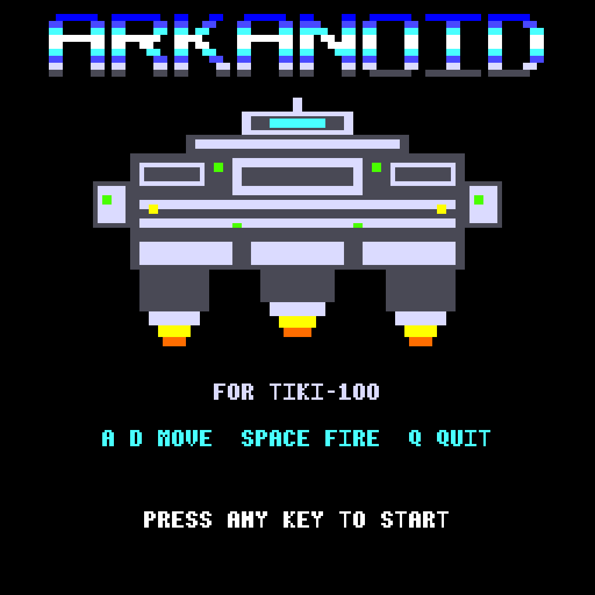
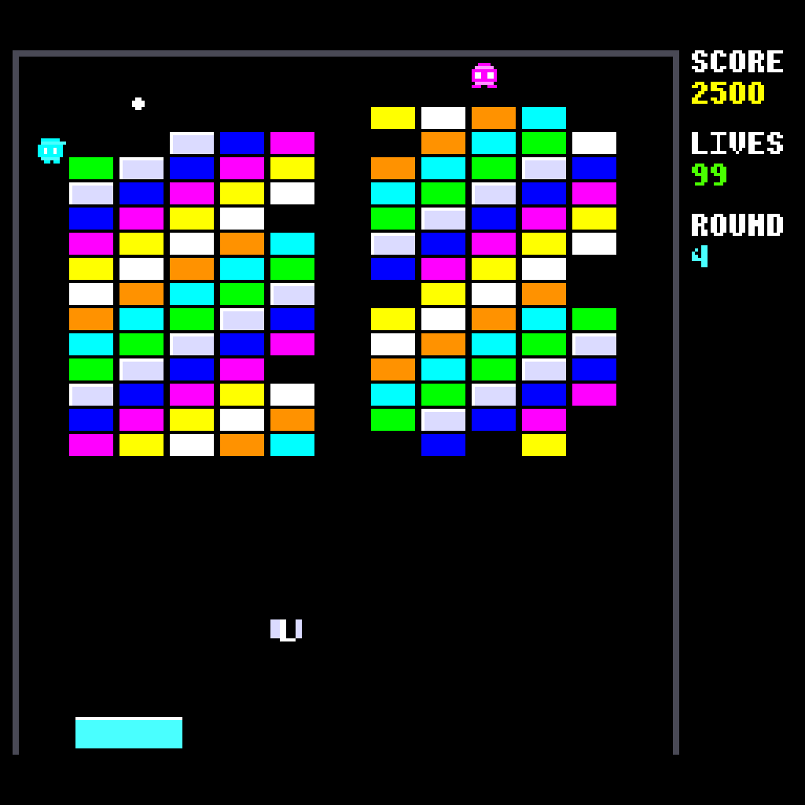
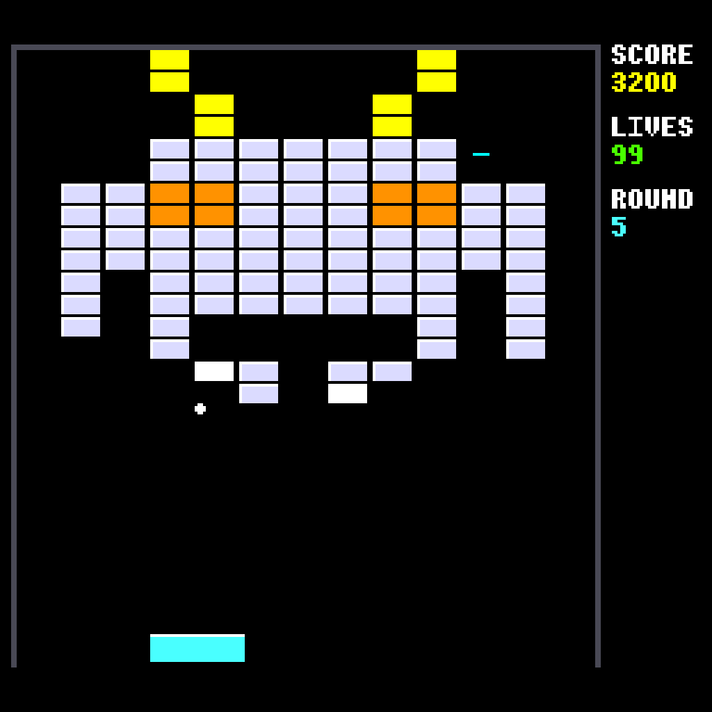
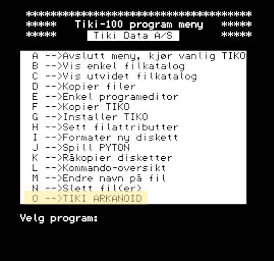

# TIKI ARKANOID

An Arkanoid clone for the **TIKI-100** computer, written in C and Z80 assembly.

 
 

---

## Quick Start

The easiest way to play is with the included emulator on Windows:

1. Launch **`tikiemul.exe`** — then load the dsk/work.dsk floppy disk image file
2. Select **O TIKI ARKANOID** from the TIKI-menu to start the game

### Running on real hardware

The `dsk/work.dsk` image is a standard TIKI-100 400K floppy format and can
be used on a real machine:

- **Gotek floppy emulator:** Copy the `.dsk` file to a USB stick and load it
  as a virtual floppy on the Gotek connected to the TIKI
- **Real 400K floppy:** Boot the TIKI-100 from the Gotek, then use the
  built-in **RÅKOPI** program to copy the disk image to a physical 5.25"
  floppy disk

---

## How to contribute

The game is not bug free. Work remains to make it better and perfect. You can
contribute by fixing bugs and improving the game. I will happily take pull
requests!

Remaining work:

- Animations are not perfect. There is flickering
- The ball speed varies depending on the amount of movement of other objects
- Sometimes pixels are left behind after moving objects
- Sound could improve
- The power-ups don't work properly
- The enemies movement is strange
- The opening of the right side escape door is missing.

---

## The TIKI-100

The **TIKI-100** (also known as the *Kontiki-100*) was a Norwegian Z80-based
microcomputer manufactured by **Tiki Data** in the mid-1980s. Designed
primarily for the Norwegian education market, it was widely deployed in
schools across Norway and became one of the most common classroom computers
of its era.

### Specifications

| | |
|---|---|
| **CPU** | Zilog Z80A @ 4 MHz |
| **RAM** | 64 KB (banked, shared with VRAM) |
| **Display** | Multiple graphics modes; Mode 3 = 256×256 pixels, 16 colours |
| **VRAM** | 32 KB, bank-switched into the lower 32K of address space |
| **Sound** | YM2149 / AY-3-8910 PSG — 3 channels |
| **Storage** | Dual 400K 5.25" floppy drives |
| **OS** | TIKO — CP/M 2.2 compatible, with custom ROM |

Despite being a CP/M machine, it had
surprisingly capable graphics and sound hardware for its time.

---

## The Game

Tiki Arkanoid is an Arkanoid clone featuring:

- **32 unique levels** — the first 7 based on the C64 original, the rest
  with custom designs (Space Invader, Skull, Pac-Man, Butterfly, and more)
- **7 power-up capsules** that fall from broken bricks:
  **S**low, **C**atch, **E**nlarge, **D**isrupt (multiball), **L**aser,
  **B**reak (stage skip), **P**layer (extra life)
- **Enemies** that drift down the playfield — destroy them with the ball or
  paddle for bonus points
- **Silver bricks** (multi-hit) and **Gold bricks** (indestructible)
- **Sound effects** for bounces, brick breaks, life loss, and stage clears
- **Stage intro jingle** transcribed from *Arkanoid: Doh It Again* (SNES)
- **Procedurally drawn title screen** with the Arkanoid mothership

### Controls

| Key | Action |
|-----|--------|
| **A** | Move left |
| **D** | Move right |
| **Space** | Launch ball / fire laser |
| **P** | Pause / unpause |
| **Q** | Quit |

### Hidden controls

| Key | Action |
|-----|--------|
| **0**  (zero)| Autoplay of/off |
| **U** | Go to next level |

---

## Building

### Prerequisites

1. **[z88dk](https://z88dk.org/)** — the Z80 cross-compiler toolchain.
   Install to `C:\z88dk` (or adjust paths in `build.ps1`).
   The `ZCCCFG` environment variable should point to `<z88dk>\lib\config`.

2. **PowerShell** (included with Windows).

### Build

```powershell
.\build.ps1
```

This compiles all C and assembly sources and produces:

- `build/tikiark.com` — the CP/M executable
- `build/tikiark.dsk` — a raw 400K disk image

Additional build options:

```powershell
.\build.ps1 -Clean       # Clean build outputs first
.\build.ps1 -Verbose     # Show full compiler output
```

---

## Deploying

### Prerequisites

1. **Djupdal TIKI-100 emulator** — place `tikiemul.exe` in the project root.
   The emulator configuration file `tikiemul.ini` is included.

2. **TIKI-100 system ROM** — `tiki.rom` (included in the repo).

3. **Base disk image** — `dsk/workbase.dsk` contains the TIKI-100 OS and menu
   system. The deploy script copies this and adds the game executable.

### Deploy and run

```powershell
.\deploy.ps1
```

This will:

1. Build `tikiark.com` (if not already built)
2. Copy `dsk/workbase.dsk` to `dsk/work.dsk`
3. Write `TIKIARK.COM` into the CP/M directory on the disk image
4. Launch the Djupdal emulator with `work.dsk` on drive A:

Once the emulator boots, select **O TIKI ARKANOID** from the TIKI-menu.

Deploy options:

```powershell
.\deploy.ps1 -NoBuild    # Skip build, deploy existing .com file
.\deploy.ps1 -NoLaunch   # Deploy to disk image without starting emulator
```

---

## Technical Details

### Architecture

The game is written in **C** (compiled with **sccz80** via z88dk) with
performance-critical graphics and input routines in **Z80 assembly**.

### Video

- Uses TIKI-100 **Mode 3** (256×256, 16 colours, CGA-like palette)
- **VRAM bank-switching**: code lives above `0x8000`; VRAM is banked into
  `0x0000–0x7FFF` during drawing operations
- Nibble-packed pixels (2 per byte), 128 bytes per scanline
- **Delta-draw** for the ball — only the previous and current positions are
  redrawn each frame for flicker-free movement
- **Dirty-flag system** for sidebar (score/lives/round) — only redraws
  values that actually changed
- All pixel-level drawing (fill rect, hline, vline, plot, text, tile blit)
  in hand-written Z80 assembly for speed

### Input

- **Direct hardware keyboard scanning** via Z80 port `$00`, bypassing CP/M
  BIOS for low-latency input
- 8×12 matrix scanned in assembly

### Sound

- All SFX use the **AY-3-8910 PSG** via z88dk's `psg_*` API
- Stage intro jingle transcribed from the SNES *Arkanoid: Doh It Again*
  start-level MIDI — two-voice melody + harmony in Eb major
- Individual effects for bounce, brick break, life loss, launch, and stage
  clear

### Game Engine

- 4×4 pixel ball with integer dx/dy velocity
- Up to 2 simultaneous enemies with independent PRNG (xorshift8)
- Power-up capsules fall from broken bricks with 7 distinct effects
- 32-bit score tracking, extra life at 20,000 points
- Vsync ISR installed at CP/M interrupt hook for frame timing

---

## Project Structure

```
build.ps1          Build script
deploy.ps1         Deploy script (writes CP/M disk image + launches emulator)
tiki.rom           TIKI-100 system ROM
tikiemul.ini       Emulator configuration
src/
  c/               C source files (main, video, font, game, levels, sound,
                   input, enemy)
  asm/             Z80 assembly (VRAM routines, keyboard scanning)
build/             Build output
dsk/               Disk images (base image + work image)
docs/              Technical notes
img/               Screenshots
```

---

## Levels

Levels 1–7 are based on the original Commodore 64 version of Arkanoid.

| # | Name |
|---|------|
| 1 | 3 empty rows, silver, then 6 color rows |
| 2 | 2 empty, staircase, silver bottom |
| 3 | 3 empty, alternating rows with gold bricks |
| 4 | Two 6-col blocks, empty col 6, diagonal 8-color cycle, 12 rows |
| 5 | Space Invader |
| 6 | Colonnade — symmetric colour pillars with crossing beams |
| 7 | Rainbow Disc — circular shape with diagonal rainbow stripes |
| 8 | Diamond — centred diamond of colour bands |
| 9 | Checkerboard — alternating bricks |
| 10 | Heart shape |
| 11 | Fortress — towers, walls, gate |
| 12 | Zigzag lightning bolt |
| 13 | Concentric rectangles |
| 14 | Downward arrow |
| 15 | Hourglass |
| 16 | Plus / cross with silver outline |
| 17 | Skull face |
| 18 | Butterfly — symmetric wings with silver body |
| 19 | Pac-Man facing right |
| 20 | Stepped pyramid |
| 21 | Spiral |
| 22 | Smiley face |
| 23 | Double wave |
| 24 | Four quadrants — silver cross divider |
| 25 | Letter X |
| 26 | Brick wall — offset masonry pattern |
| 27 | Tunnel — winding corridor with silver walls |
| 28 | Bowtie — two triangles meeting at center |
| 29 | Three stripes with scattered silver |
| 30 | Anchored islands — four floating blocks with gold anchors |
| 31 | Diagonal split — two colours divided by silver diagonal |
| 32 | The Gauntlet — dense silver field with colour veins |

---

## Credits

**TIKI ARKANOID** by Arctic Retro. support@ovesen.net

Built with [z88dk](https://z88dk.org/). Emulated with the
[Djupdal TIKI-100 emulator](https://github.com/djupdal/tiki-emul).
